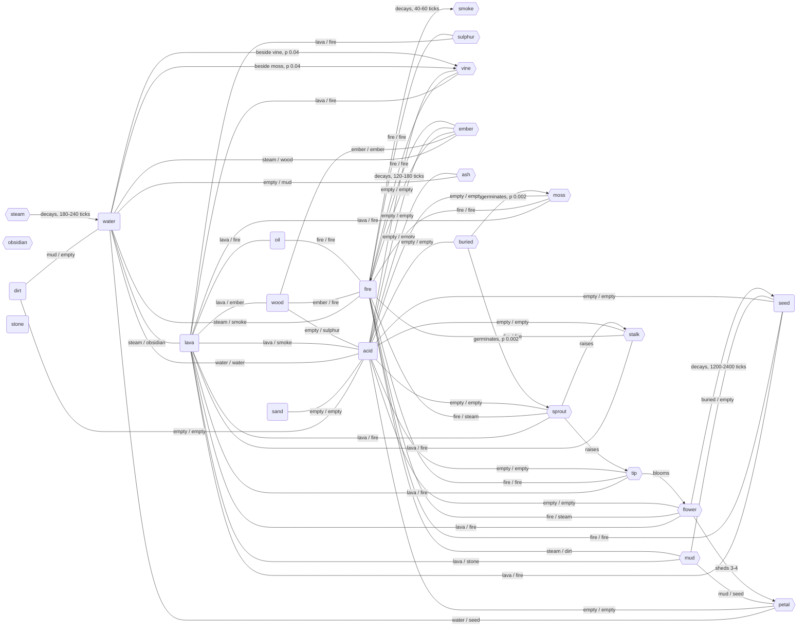

<!-- Generated by `pnpm --filter silt run graph` - do not hand-edit. -->

# silt element interactions

Every reaction and decay below is read back out of the live registry
(`createRegistry(v1Elements, v1Reactions)`), so what is listed is what the sim
resolves: tag rows already expanded, `maxHardness` pairs absent rather than
"immune", and the first matching row winning. The hooks are the exception - growth
(`src/sim/growth.ts`), germination (`src/sim/seedBank.ts`) and the land plant's
raise and bloom (`src/sim/stalk.ts`) are code rather than table rows, so their
edges are declared in the generator and must be kept in step with them.

## Summary

|                          | count |
| ------------------------ | ----- |
| elements                 | 25    |
| paintable                | 10    |
| products only            | 15    |
| reaction pairs           | 48    |
| decays                   | 8     |
| of which fade to nothing | 4     |
| growth edges             | 2     |
| hook transmutations      | 4     |

## Graph

Rounded nodes are paintable (the rail's `PAINTABLE_IDS`); hexagons are reachable
only by reacting. A reaction edge is undirected and its label reads
`<what the left node becomes> / <what the right node becomes>`, where
`empty` means the cell is cleared. Decay and growth edges are directed.

## Interactions

| reagents       | p     | outcome                                                                                | mechanism                          |
| -------------- | ----- | -------------------------------------------------------------------------------------- | ---------------------------------- |
| dirt + water   | 0.4   | dirt -> mud, water -> empty                                                            | reaction row 22 (water + dirt)     |
| dirt + acid    | 0.3   | dirt -> empty, acid -> empty                                                           | reaction row 18 (acid + solid)     |
| sand + acid    | 0.3   | sand -> empty, acid -> empty                                                           | reaction row 19 (acid + powder)    |
| water + lava   | 1     | water -> steam, lava -> obsidian                                                       | reaction row 1 (water + lava)      |
| water + fire   | 1     | water -> steam, fire -> smoke                                                          | reaction row 2 (water + fire)      |
| water + acid   | 1     | water -> water, acid -> water                                                          | reaction row 20 (acid + water)     |
| water + ember  | 1     | water -> steam, ember -> wood                                                          | reaction row 16 (water + ember)    |
| water + ash    | 0.4   | water -> empty, ash -> mud                                                             | reaction row 23 (water + ash)      |
| water + petal  | 0.001 | water -> water, petal -> seed                                                          | reaction row 28 (petal + water)    |
| lava + wood    | 0.1   | lava -> lava, wood -> ember                                                            | reaction row 13 (lava + wood)      |
| lava + oil     | 0.15  | lava -> lava, oil -> fire                                                              | reaction row 14 (lava + flammable) |
| lava + acid    | 1     | lava -> lava, acid -> smoke                                                            | reaction row 21 (acid + lava)      |
| lava + sulphur | 0.15  | lava -> lava, sulphur -> fire                                                          | reaction row 14 (lava + flammable) |
| lava + mud     | 1     | lava -> lava, mud -> stone                                                             | reaction row 25 (mud + lava)       |
| lava + seed    | 0.15  | lava -> lava, seed -> fire                                                             | reaction row 14 (lava + flammable) |
| lava + moss    | 0.15  | lava -> lava, moss -> fire                                                             | reaction row 14 (lava + flammable) |
| lava + vine    | 0.15  | lava -> lava, vine -> fire                                                             | reaction row 14 (lava + flammable) |
| lava + sprout  | 0.15  | lava -> lava, sprout -> fire                                                           | reaction row 14 (lava + flammable) |
| lava + tip     | 0.15  | lava -> lava, tip -> fire                                                              | reaction row 14 (lava + flammable) |
| lava + stalk   | 0.15  | lava -> lava, stalk -> fire                                                            | reaction row 14 (lava + flammable) |
| lava + flower  | 0.15  | lava -> lava, flower -> fire                                                           | reaction row 14 (lava + flammable) |
| wood + fire    | 0.2   | wood -> ember, fire -> fire                                                            | reaction row 8 (fire + wood)       |
| wood + acid    | 0.3   | wood -> empty, acid -> sulphur                                                         | reaction row 17 (acid + wood)      |
| wood + ember   | 0.02  | wood -> ember, ember -> ember                                                          | reaction row 15 (ember + wood)     |
| oil + fire     | 0.9   | oil -> fire, fire -> fire                                                              | reaction row 4 (fire + oil)        |
| fire + sulphur | 1     | fire -> fire, sulphur -> fire                                                          | reaction row 3 (fire + sulphur)    |
| fire + mud     | 1     | fire -> steam, mud -> dirt                                                             | reaction row 24 (mud + fire)       |
| fire + seed    | 0.3   | fire -> fire, seed -> fire                                                             | reaction row 6 (fire + seed)       |
| fire + moss    | 0.2   | fire -> fire, moss -> fire                                                             | reaction row 7 (fire + moss)       |
| fire + vine    | 0.6   | fire -> fire, vine -> fire                                                             | reaction row 5 (fire + vine)       |
| fire + ember   | 0.003 | fire -> fire, ember -> ash                                                             | reaction row 12 (fire + ember)     |
| fire + sprout  | 0.4   | fire -> fire, sprout -> steam                                                          | reaction row 10 (fire + sprout)    |
| fire + tip     | 0.4   | fire -> fire, tip -> fire                                                              | reaction row 11 (fire + flammable) |
| fire + stalk   | 0.4   | fire -> fire, stalk -> fire                                                            | reaction row 11 (fire + flammable) |
| fire + flower  | 0.4   | fire -> fire, flower -> steam                                                          | reaction row 9 (fire + flower)     |
| acid + seed    | 0.3   | acid -> empty, seed -> empty                                                           | reaction row 19 (acid + powder)    |
| acid + moss    | 0.3   | acid -> empty, moss -> empty                                                           | reaction row 18 (acid + solid)     |
| acid + vine    | 0.3   | acid -> empty, vine -> empty                                                           | reaction row 18 (acid + solid)     |
| acid + ember   | 0.3   | acid -> empty, ember -> empty                                                          | reaction row 18 (acid + solid)     |
| acid + ash     | 0.3   | acid -> empty, ash -> empty                                                            | reaction row 19 (acid + powder)    |
| acid + buried  | 0.3   | acid -> empty, buried -> empty                                                         | reaction row 18 (acid + solid)     |
| acid + sprout  | 0.3   | acid -> empty, sprout -> empty                                                         | reaction row 18 (acid + solid)     |
| acid + tip     | 0.3   | acid -> empty, tip -> empty                                                            | reaction row 18 (acid + solid)     |
| acid + stalk   | 0.3   | acid -> empty, stalk -> empty                                                          | reaction row 18 (acid + solid)     |
| acid + flower  | 0.3   | acid -> empty, flower -> empty                                                         | reaction row 18 (acid + solid)     |
| acid + petal   | 0.3   | acid -> empty, petal -> empty                                                          | reaction row 19 (acid + powder)    |
| mud + seed     | 0.1   | mud -> buried, seed -> empty                                                           | reaction row 26 (seed + mud)       |
| mud + petal    | 0.01  | mud -> mud, petal -> seed                                                              | reaction row 27 (petal + mud)      |
| fire           | -     | fire -> smoke after 40-60 ticks                                                        | lifetime                           |
| smoke          | -     | smoke -> empty after 200-255 ticks                                                     | lifetime                           |
| steam          | -     | steam -> water after 180-240 ticks                                                     | lifetime                           |
| seed           | -     | seed -> empty after 1280-2000 ticks                                                    | lifetime                           |
| ember          | -     | ember -> fire after 120-180 ticks                                                      | lifetime                           |
| stalk          | -     | stalk -> empty after 2720-3200 ticks                                                   | lifetime                           |
| flower         | -     | flower -> seed after 1200-2400 ticks, shedding 3-4 petal                               | lifetime                           |
| petal          | -     | petal -> empty after 80-150 ticks                                                      | lifetime                           |
| moss + water   | 0.04  | water -> vine                                                                          | growth hook (growth.ts)            |
| vine + water   | 0.04  | water -> vine                                                                          | growth hook (growth.ts)            |
| buried + water | 0.002 | water above -> moss, buried -> dirt (soaked 120 ticks under 2 cells of standing water) | germinate hook (seedBank.ts)       |
| buried         | 0.002 | air above -> sprout, buried -> dirt (sky open, no standing water)                      | germinate hook (seedBank.ts)       |
| sprout         | -     | air above -> tip, sprout -> stalk (on the first tick the sky above is open)            | raise hook (stalk.ts)              |
| tip            | -     | tip -> flower (budget spent, or boxed in)                                              | bloom hook (stalk.ts)              |
