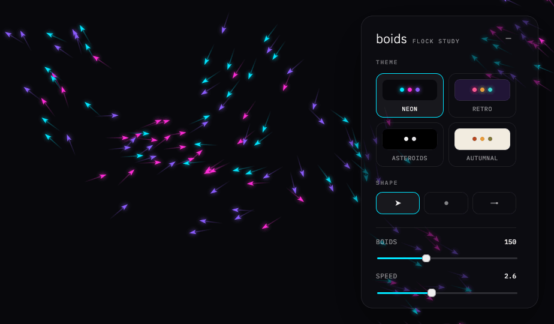

# Handoff: Boids Simulator — minimal interface



## Overview
A beautifully minimal boids (flocking) simulator. A full-bleed simulation canvas
fills the viewport; a single floating, frosted-glass **settings dialog** in the
top-right corner lets the user tune the flocking behaviour, pick a boid **shape**,
and switch between four **theme** presets. The default theme is dark with glowing
neon boids. The intended feel is calm and meditative — no chrome, no toolbars,
just the flock and one quiet panel.

## About the Design Files
The files in this bundle are **design references created in HTML/CSS/JS** — a
prototype showing the intended look and behaviour, not production code to ship
directly. The task is to **recreate this design in your target codebase** using
its established framework and patterns (React, Vue, Svelte, SwiftUI, native,
etc.). If no environment exists yet, pick the most appropriate framework and
implement there. `styles.css` is a faithful token/CSS reference; port the values,
don't necessarily copy the file verbatim.

Note: the canvas in `boids.js` paints **one static reference frame** so the page
matches the mockup. The real product should run an actual animated boids
simulation (Reynolds' three rules — separation, alignment, cohesion) driven by
the same parameters. The rendering details (shape geometry, trail/glow, palettes)
in `boids.js` `draw()` are directly reusable for the live version.

## Fidelity
**High-fidelity.** Colours, typography, spacing, radii and control styling are
final. Recreate the panel pixel-accurately. The flock rendering (boid geometry,
glow, trails) is also final; only the *motion* is left to implement.

## Screens / Views

### 1. Simulator (single view)
- **Purpose:** Watch the flock; open the dialog to customise it.
- **Layout:**
  - `canvas.sim-canvas` — `position:fixed; inset:0`, full viewport, sits behind everything.
  - `aside.panel` — `position:fixed; top:26px; right:26px`, width **296px**,
    `max-height: calc(100vh - 52px)` with `overflow-y:auto`. Frosted glass.
  - When collapsed, the panel is replaced by `button.fab` (46×46, same corner).

#### Panel components (top → bottom)
- **Header** — wordmark `boids` (IBM Plex Sans, weight 300, 21px) + tag
  `FLOCK STUDY` (IBM Plex Mono, 9.5px, uppercase, letter-spacing .16em, muted).
  Right-aligned collapse button (a minus glyph, 26×26, muted).
- **Theme** group label, then a **2×2 grid** (`gap:8px`) of theme chips. Each chip:
  a preview swatch (36px tall, rounded 9px, filled with that theme's background and
  showing 3 palette dots) above a mono uppercase name. Selected chip: 1px accent
  border + faint `--soft` fill; name brightens to `--text`.
- **Shape** group label, then a **segmented control** (3 equal buttons, `gap:7px`):
  triangle / dot / line, each a 17px SVG icon. Pressed button: accent border +
  `--soft` fill + `--text` icon colour.
- **Hairline** divider (1px, `--hairline`).
- **7 sliders** (see below), each: a row with mono uppercase label (left) and
  mono value (right), then a thin 3px range track filled to the current value in
  the accent colour, with a 15px round accent thumb ringed in the panel colour.

## Interactions & Behavior
- **Theme chip click** → sets `data-theme` on `<html>` (swaps all CSS tokens),
  marks chip `aria-selected`, repaints flock with that palette/glow/mode.
- **Shape button click** → sets `state.shape`, toggles `aria-pressed`, repaints.
- **Slider input** → updates the parameter, the readout, and the track fill
  (`--pct` custom property = `(value-min)/(max-min)*100%`), and (in production)
  the live simulation reads the new value on the next frame.
- **Collapse button** → hides panel, shows FAB. **FAB** → restores panel.
- Transitions: chip/button `border-color` & `background` **.15s**; slider thumb
  `transform .15s` scaling to 1.14 on hover; body `background .2s` on theme change.
- No hover/loading/error/validation states beyond the above — keep it minimal.

## State Management
```
state = {
  theme: 'neon' | 'retro' | 'asteroids' | 'autumnal',   // default 'neon'
  shape: 'triangle' | 'dot' | 'line',                    // default 'triangle'
  params: {
    count:      150,   // 20–400,  step 1
    speed:      2.6,   // 0.5–6,   step 0.1
    separation: 1.3,   // 0–3,     step 0.05
    alignment:  1.0,   // 0–3,     step 0.05
    cohesion:   0.9,   // 0–3,     step 0.05
    vision:     66,    // 20–140,  step 1 (px)
    trail:      0.42,  // 0–1,     step 0.01 (rendered as %)
  }
}
```
`theme` drives the CSS tokens (via `data-theme`) AND the canvas palette. `params`
feed the flocking algorithm. `shape` selects boid geometry.

## Design Tokens

### Fonts
- **IBM Plex Sans** — wordmark only (weight 300).
- **IBM Plex Mono** — every label, value and name (400 / 500).

### Type scale
- Wordmark 21px/300 · tag 9.5px/400 · group label 9.5px/500 (ls .18em) ·
  slider label 11px/400 · slider value 11px/500 · chip name 10px/400.

### Radii
panel 20px · chip 13px · seg button 11px · preview swatch / small 9px · fab 14px · icon-btn 8px.

### Shadows
panel `0 28px 80px rgba(0,0,0,.5)` · fab `0 14px 40px rgba(0,0,0,.45)` ·
slider thumb `0 1px 5px rgba(0,0,0,.45)`.

### Glass
panel/fab `backdrop-filter: blur(22px) saturate(1.2)`.

### Theme tokens
| token | neon (default) | retro | asteroids | autumnal (light) |
|---|---|---|---|---|
| `--bg` | `#08080c` | `#221436` | `#000000` | `#f2ece0` |
| `--accent` | `#00e6ff` | `#ff5d8f` | `#ffffff` | `#b8451f` |

The remaining tokens (`--text`, `--sub`, `--panel-bg`, etc.) are dark-on-light for
`autumnal` and light-on-dark for the other three — see `styles.css` `:root` and the
`[data-theme="autumnal"]` block for exact values.

### Boid palettes & rendering (canvas — see `boids.js`)
| theme | palette | glow (shadowBlur) | draw mode |
|---|---|---|---|
| neon | `#00e6ff · #ff2bd6 · #8b5cff` | 14 | fill |
| retro | `#ff5d8f · #ffb03a · #39d5c6` | 9 | fill |
| asteroids | `#ffffff · #d9e2ff` | 0 | stroke (vector outline) |
| autumnal | `#b8451f · #d98a37 · #7c7a3a · #9c392c` | 0 | fill |

- **Triangle** boid: path `(6.5,0) (-5,3.7) (-2.4,0) (-5,-3.7)`, rotated to heading.
- **Dot** boid: circle r≈2.7.
- **Line** boid: 11px stroke with a small head circle at the tip.
- **Trail**: a gradient streak behind each boid, length `6 + trail*46 + speed*3`,
  fading from `alpha .42` (fill) / `.5` (stroke) to 0.

## Assets
- **Fonts**: IBM Plex Sans + IBM Plex Mono (Google Fonts). No image assets.
- **Icons**: inline SVG (collapse minus, FAB sliders glyph, 3 shape icons) — all
  in `index.html`, styled with `currentColor`.

## Files
- `index.html` — page markup (canvas + dialog structure).
- `styles.css` — all design tokens and component styles (the reference stylesheet).
- `boids.js` — theme/shape/slider specs, control wiring, and the canvas draw code.
- `screenshot.png` — rendered reference (neon theme, triangle boids).
